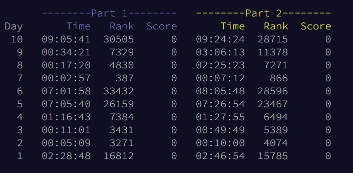

# Advent of code solutions for year 2021

Official website [Advent of code](https://adventofcode.com/).
My personal inputs are in ./inputs folder.

Solutions are made with python 3.10 and Python's standard library and numpy

Current standings per day.
